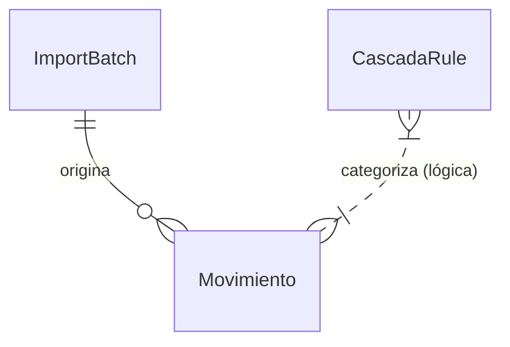

# DATA MODEL: TAUROS v2 (PRIME)

## 1. Esquema General
TAUROS v2 utiliza una base de datos relacional ligera (**SQLite**) gestionada a través de **SQLAlchemy ORM**. El diseño está optimizado para la trazabilidad de importaciones y la flexibilidad en la categorización.

## 2. Inventario de Entidades

### A. Movimiento (`Movement`)
La entidad principal que contiene la información financiera normalizada.
- **`id`** (Integer, PK): Identificador único.
- **`fecha`** (Date): Fecha de la transacción bancaria.
- **`descripcion`** (String): Descripción original del extracto.
- **`monto`** (Float): Valor monetario (positivo/negativo).
- **`categoria`** (String): Categoría de alto nivel (ej. "OPERATIVO", "INVERSION").
- **`subcategoria`** (String): Desglose específico (ej. "Sueldos", "Publicidad").
- **`tipo`** (Enum): INGRESO / EGRESO.
- **`balance`** (Float): Saldo acumulado (opcional/calculado).
- **`batch_id`** (Integer, FK): Relación con el lote de importación de origen.
- **`confidence_score`** (Float): Valor entre 0 y 1 que indica la certeza de la categorización automática.

### B. ImportBatch (`ImportBatch`)
Rastrea la procedencia de los datos para auditoría y reversión.
- **`id`** (Integer, PK): Identificador del lote.
- **`filename`** (String): Nombre del archivo CSV/XLS original.
- **`imported_at`** (DateTime): Timestamp de la carga.
- **`count`** (Integer): Número de transacciones procesadas satisfactoriamente.
- **`bank_name`** (String): Entidad financiera detectada (Galicia, ICBC, etc.).

### C. CascadaRule (`CascadaRule`)
Reglas de negocio jerárquicas para el motor de categorización.
- **`id`** (Integer, PK): Identificador de la regla.
- **`pattern`** (String): Expresión regular o cadena de coincidencia para la descripción.
- **`category`** (String): Categoría a asignar.
- **`subcategory`** (String): Subcategoría a asignar.
- **`weight`** (Integer): Prioridad de la regla (pesos altos ganan sobre bajos).
- **`is_active`** (Boolean): Estado de la regla.

## 3. Relaciones y Flujos de Datos

1. **Ingesta**: Un archivo se convierte en un `ImportBatch`.
2. **Parsing**: Los registros del archivo se transforman en múltiples instancias de `Movimiento` ligadas al `batch_id`.
3. **Categorización**: El motor `Cascada` itera sobre las `CascadaRule` activas, aplicando el patrón a la `descripcion` de cada `Movimiento` sin categoría asignada.

## 4. Restricciones y Validaciones
- **Unicidad**: Se implementa lógica en el backend (Service Layer) para evitar duplicados basados en `fecha`, `descripcion` y `monto` dentro de un mismo período.
- **Tipado**: Todos los montos se normalizan a `float` antes de la persistencia para asegurar la integridad de los cálculos en el frontend.
- **Nulidad**: `fecha`, `monto` y `descripcion` son campos obligatorios (`nullable=False`).
